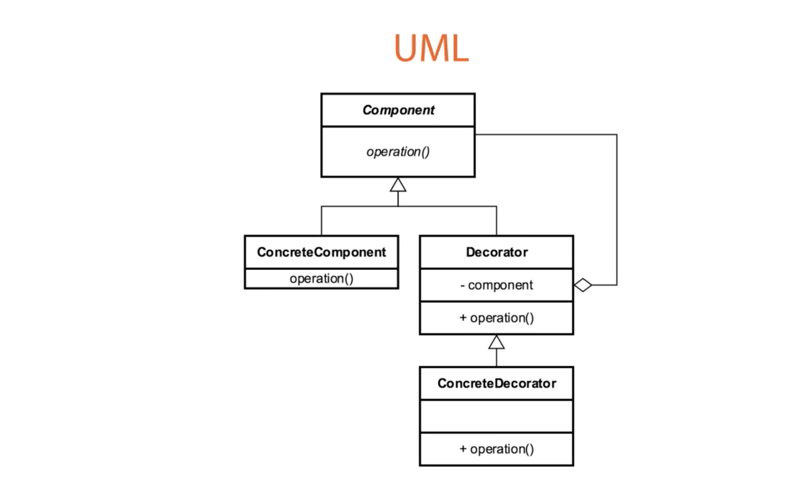
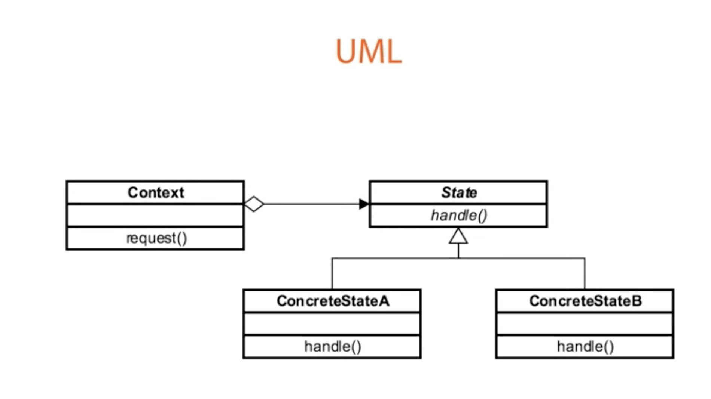
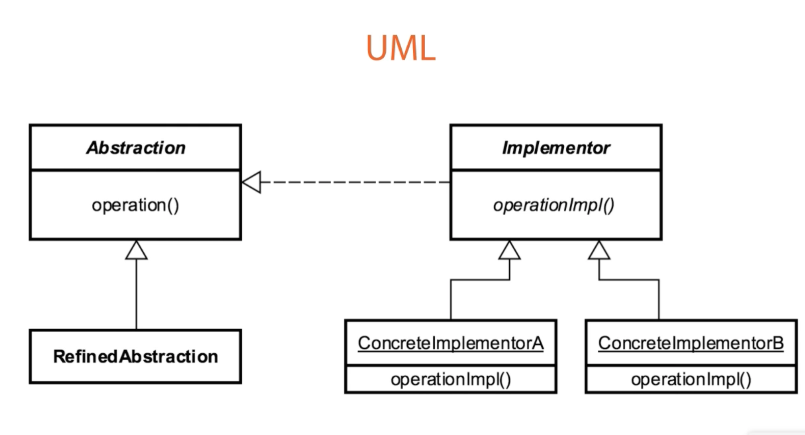

# Decorator pattern

Decorator pattern allows a user to add new functionality to an existing object without altering its structure. This type of design pattern
comes under structural pattern as this pattern acts as a wrapper to existing class.

Component: Sandwich
Concrete Component: Simple Sandwich
Decorator: SandwichDecorator
Concrete Decorator: MeatDecorator, Dressing Decorator 

# State Pattern

Context: Fan
State: State
ConcreteStateA: FanHighState
ConcreteStateB: FanLowState

# Bridge Pattern
<ul>
<li>Abstraction: Formatter</li>
<li>Implementor:  </li>
<li>ConcreteImplementorA: StringFormatter</li>
<li>ConcreteImplementorB: HtmlFormatter</li>
</ul>

The Bridge pattern attempts to solve this problem by switching from inheritance to the object composition. What this means is that you extract one of the dimensions into a separate class hierarchy, so that the original classes will reference an object of the new hierarchy, instead of having all of its state and behaviors within one class.

